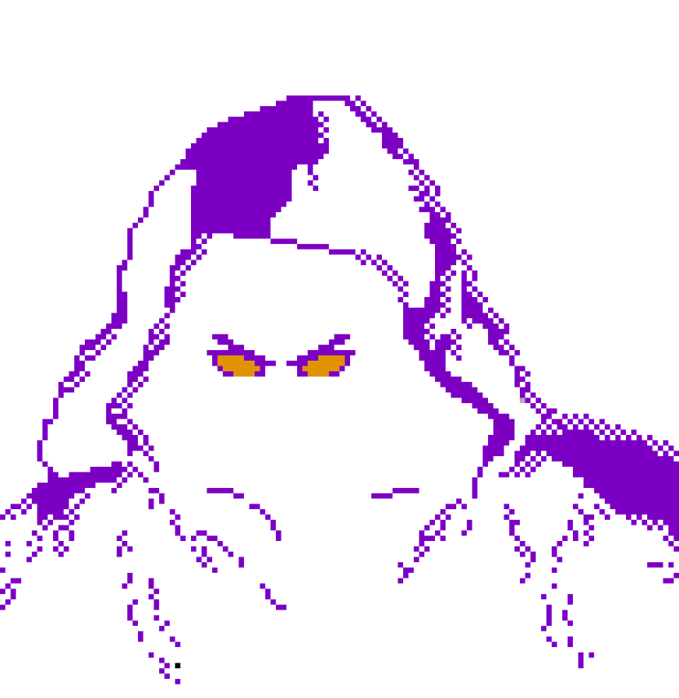
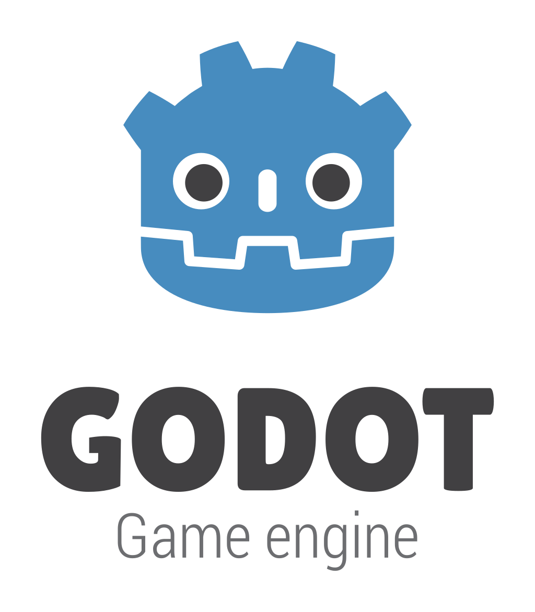

<!---
Caso o jogo tenha uma logo, disponibilizá-la no README
--->

## 📃 Sobre o jogo
Necromantix é um jogo single-player em que você percebe que a morte é só o começo... Colete almas e evolua seu mago para alcançar o objetivo maior da vida.

## 🎮 Engine & linguagens
<!---
Aqui recomenda-se que sejam colocados os ícones da game engine e das linguagens de programação que foram utilizadas no desenvolvimento do seu jogo, como o exemplo à seguir
--->

## 🧠 Desenvolvido por Mad Divos

<!-- Tabela com os nomes e fotos-->
| <a href="https://github.com/eng-Bruno"></img></a> | <a href="https://github.com/ggomesbr"></img></a> | <a href="https://github.com/matix0"></img></a> | <a href="https://github.com/rufinovfr"></img></a> |
|----------|:------:|:------:|:------:|
| [Bruno Oliveira](https://github.com/eng-Bruno) | [Gabriel Gomes](https://github.com/ggomesbr) | [Mateus Vinicius](https://github.com/matix0) | [Vinicius Rufino](https://github.com/rufinovfr) |